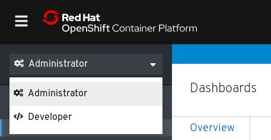
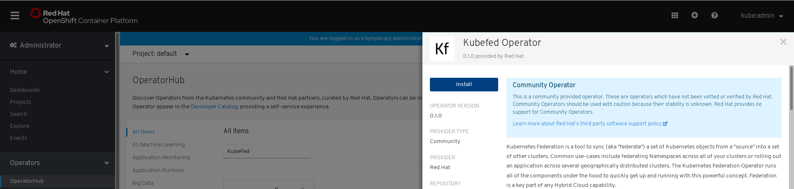
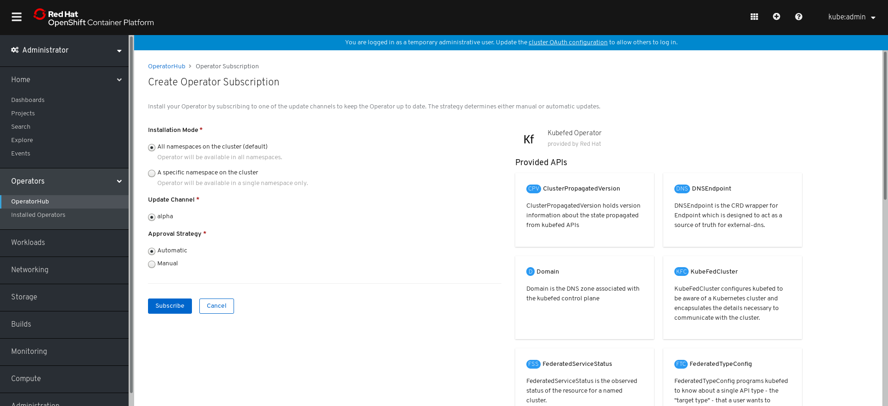
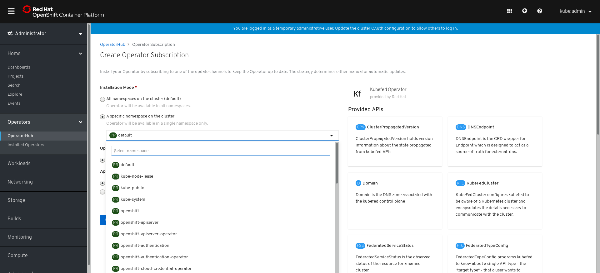

# Installing the KubeFed Operator

## Installing from the OperatorHub using the web console

This procedure explains how to install and subscribe to the KubeFed Operator from the OperatorHub using the OpenShift Container Platform web console.

### Prerequisites
- Access to an OpenShift Container Platform cluster using an account with `cluster-admin` permissions.
- Any namespaces required for a namespace scoped installation must be created before installing the Operator.

### Procedure

1. Login to the OpenShift Container Platform web console and access the **Administrator** console using the dropdown menu.

  
1.  Navigate to the **Operators** menu and select **OperatorHub**.
1. Type **KubeFed** into the filter box to find the KubeFed Operator.
1. Select the KubeFed Operator to display information about the Operator, then use the **Install** button to install it.

  
1. Select an **Installation mode**.

  

  The installation can be either cluster scoped (the Operator will reconcile the KubeFedWebHook and KubeFed CR instances in all namespaces), or namespace scoped (the Operator is available only on the specified namespace).

  If you are installing the Operator in a specific namespace, a dropdown menu will appear that allows you to select a namespace from those that exist on the cluster. You must create the required namespace before installing the Operator.

  
1. Select an **Approval strategy**. This determines whether updates to the Operator will be automated or manual.
1. Use the **Subscribe** button to complete the installation.
1. Within a few moments, the KubeFed Operator will appear in the **Installed Operators** menu. You will be redirected to this menu automatically.

  
